# CareNexus - Complete Project Guide

> An AI-Powered Medical Symptom Analysis and Disease Prediction Platform

---

## 📋 Project Overview

**CareNexus** is a full-stack healthcare application that helps users analyze medical symptoms through multiple input modalities (text, voice, and images) and provides AI-powered disease predictions with severity assessments and care recommendations.

### Key Features
| Feature | Description |
|---------|-------------|
| **Text Analysis** | Natural language symptom extraction using NER |
| **Voice Input** | Speech-to-text with symptom analysis |
| **Image Analysis** | Skin disease classification from photos |
| **Severity Triage** | Emergency/Urgent/Moderate/Mild classification |
| **Care Recommendations** | Personalized health guidance |
| **Nearby Medical Help** | Location-based hospital/clinic finder |

---

## 🏗️ System Architecture


### Component Breakdown

| Layer | Technology | Purpose |
|-------|------------|---------|
| **Frontend** | React 18, TypeScript, Vite | User interface |
| **UI Library** | Radix UI, Tailwind CSS | Component styling |
| **State Management** | TanStack React Query | Server state & caching |
| **ML Backend** | FastAPI, Python 3.10 | API server for ML models |
| **Text Model** | BERT (Transformers) | Symptom NER extraction |
| **Image Model** | EfficientNet (TensorFlow/Keras) | Skin disease classification |
| **Database** | Supabase (PostgreSQL) | User data & analysis history |
| **Hosting** | Vercel + Hugging Face Spaces | Cloud deployment |

---

## 🔄 Data Flow Architecture


### Request-Response Example

**Input**: `"I have severe chest pain and difficulty breathing"`

**Processing Pipeline**:
1. Text tokenization → BERT encoder → Token classification
2. Symptom extraction: `["chest pain", "difficulty breathing"]`
3. Disease mapping: `["heart attack", "angina", "pneumonia"]`
4. Severity assessment: `"emergency"`
5. Generate recommendations

**Output**:
```json
{
  "symptoms": ["chest pain", "difficulty breathing"],
  "diseases": [{"name": "heart attack", "score": 3}],
  "severity": "emergency",
  "recommendations": ["🚨 SEEK IMMEDIATE EMERGENCY CARE"]
}
```

---

## 🤖 Machine Learning Models

### 1. Text Model - Medical NER (Named Entity Recognition)

**Purpose**: Extract medical symptoms from natural language text


| Specification | Details |
|---------------|---------|
| **Architecture** | BERT-based Token Classification |
| **Framework** | PyTorch + Hugging Face Transformers |
| **Size** | ~431 MB |
| **Labels** | B-SYMPTOM, I-SYMPTOM, O |
| **Confidence Threshold** | 0.3 |

**Key Files**:
- `model.safetensors` - Model weights
- `tokenizer.json` - Tokenizer vocabulary
- `config.json` - Model configuration

---

### 2. Image Model - Skin Disease Classification

**Purpose**: Classify skin conditions from uploaded images


| Specification | Details |
|---------------|---------|
| **Architecture** | EfficientNet (Transfer Learning) |
| **Framework** | TensorFlow/Keras |
| **Size** | ~41 MB |
| **Input** | 256x256 RGB images |
| **Classes** | 10 skin conditions |

**Supported Conditions**:
Eczema, Psoriasis, Melanoma, Dermatitis, Fungal Infection, Acne, Ringworm, Vitiligo, Warts, Healthy Skin

---

### 3. Hybrid Extraction Pipeline

The system uses a **hybrid approach** combining ML + Rules for maximum accuracy:


**Why Hybrid?**
- ML model catches complex symptoms
- Rules catch common patterns model might miss
- Combined approach = higher accuracy

**Rule Examples**:
```python
patterns = {
    r'\bchest\s+pain\b': 'chest pain',
    r'\bdifficulty\s+breathing\b': 'difficulty breathing',
    r'\bhigh\s+fever\b': 'fever',
}
```

---

## 🎨 Frontend Architecture

### Component Structure

```
src/
├── components/
│   ├── ui/                    # Radix UI primitives
│   ├── TextSymptomInput.tsx   # Text analysis
│   ├── VoiceSymptomInput.tsx  # Voice recording
│   ├── ImageSymptomInput.tsx  # Image upload
│   └── ...
├── pages/
│   ├── Index.tsx              # Landing page
│   ├── PatientAuth.tsx        # Login/Register
│   └── PatientDashboard.tsx   # Main dashboard
├── integrations/supabase/     # Supabase client
└── lib/                       # Utilities
```

### Key Components

| Component | Function |
|-----------|----------|
| `TextSymptomInput.tsx` | Text input → ML API → Display results |
| `VoiceSymptomInput.tsx` | Web Speech API → Text → ML API |
| `ImageSymptomInput.tsx` | Image upload → FormData → ML API |

---

## ⚡ Backend API (FastAPI)

### API Endpoints

| Endpoint | Method | Description |
|----------|--------|-------------|
| `/` | GET | Health check |
| `/predict_text` | POST | Analyze text symptoms |
| `/predict_image` | POST | Analyze skin image |
| `/predict_combined` | POST | Combined analysis |
| `/symptoms` | GET | List known symptoms |
| `/diseases` | GET | List known diseases |
| `/nearby_medical_help` | POST | Find nearby hospitals |

### Server Configuration

```python
app = FastAPI(title="Medical Symptom & Disease Predictor")

app.add_middleware(
    CORSMiddleware,
    allow_origins=["*"],
    allow_credentials=True,
    allow_methods=["*"],
    allow_headers=["*"],
)
```

---

## 🗄️ Database Schema (Supabase)


---

## 📊 Severity Assessment Logic

```mermaid
graph TD
    A[Input Analysis] --> B{Emergency Keywords?}
    B -->|Yes| C[🚨 EMERGENCY]
    B -->|No| D{Urgent Keywords?}
    D -->|Yes| E[⚠️ URGENT]
    D -->|No| F{Moderate Symptoms?}
    F -->|Yes| G[📅 MODERATE]
    F -->|No| H[👀 MILD]
```



| Level | Triggers | Action |
|-------|----------|--------|
| 🚨 **Emergency** | chest pain, stroke, seizure | Call 911 immediately |
| ⚠️ **Urgent** | high fever, blood in urine | Within 24 hours |
| 📅 **Moderate** | fever, headache, nausea | Schedule appointment |
| 👀 **Mild** | cold, fatigue, mild pain | Monitor at home |

---

## 🚀 Deployment Architecture


### Deployment URLs

| Service | URL |
|---------|-----|
| Frontend | `https://care-six-iota.vercel.app` |
| ML API | `https://amitabh-02-carenexus-api.hf.space` |
| Database | `https://guplomlrlelduqdlprhx.supabase.co` |

### Environment Variables

```env
# Frontend (Vercel)
VITE_SUPABASE_PROJECT_ID=guplomlrlelduqdlprhx
VITE_SUPABASE_URL=https://guplomlrlelduqdlprhx.supabase.co
VITE_SUPABASE_PUBLISHABLE_KEY=eyJhbGc...
VITE_ML_API_URL=https://amitabh-02-carenexus-api.hf.space
```

---

## 🔒 Security Features

| Feature | Implementation |
|---------|---------------|
| **Authentication** | Supabase Auth (JWT tokens) |
| **Row Level Security** | PostgreSQL RLS policies |
| **API CORS** | FastAPI CORS middleware |
| **HTTPS** | Enforced on all services |
| **Environment Variables** | Secrets not in code |

---

## 🛠️ Tech Stack Summary

| Category | Technologies |
|----------|-------------|
| **Frontend** | React 18, TypeScript, Vite, Tailwind CSS, Radix UI |
| **Backend** | Python 3.10, FastAPI, Uvicorn |
| **ML/AI** | PyTorch, TensorFlow, Keras, Hugging Face Transformers |
| **Database** | Supabase (PostgreSQL), Row Level Security |
| **Deployment** | Vercel, Hugging Face Spaces, Docker |
| **DevOps** | Git, GitHub, CI/CD via Vercel |

---

## 📈 Future Improvements

- [ ] Add more skin disease classes
- [ ] Implement doctor-patient chat
- [ ] Add prescription management
- [ ] Mobile app (React Native)
- [ ] Multi-language support
- [ ] Integration with wearable devices

---

## 🎯 Interview Talking Points

**Q: Why hybrid ML approach?**
> Pure ML may miss common phrases; rules provide safety net for higher recall.

**Q: Why separate deployments?**
> ML models too large for serverless (Vercel 250MB limit). HF Spaces optimized for ML.

**Q: How handle cold starts?**
> Models preloaded at container start. First request ~30-60 sec, then instant.

**Q: Security considerations?**
> No PHI without consent, RLS for data isolation, HTTPS everywhere.

**Q: How would you scale?**
> GPU tier, Redis caching, model quantization, connection pooling.

---

*Last Updated: December 7, 2025*
